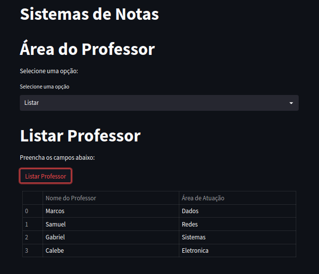

# **Docker - Sistema de Gerenciamento de Notas**
Marçal Henrique Moreira  
Discente em Engenharia de Computação pelo IFMG - Campus Bambuí  
GitHub: <https://www.github.com/marcalhenrique>
--

------
# **1 - Projeto**
Um sistema de gerenciamento de notas desenvolvido em python, utilizando o Streamlit para a interface gráfica, PostgreSQL para a criação e gerenciamento do banco de dados e Docker para a criação do ambiente de desenvolvimento.  
O ambiente é consistido em 2 containers, um para o banco de dados e outro para a aplicação.

## **1.1 - Pré-requisitos**
Para utilizar o projeto é necessário ter instalado em sua máquina o Docker e o Docker Compose.

## **1.2 - Como utilizar**
Para utilizar o projeto, basta clonar o repositório e executar o comando abaixo na pasta raiz do projeto.
```bash
docker-compose up
```
Após a execução do comando, o sistema estará disponível em <http://localhost:8501>.


# **1.3 - Sobre o Desenvolvimento**
Este projeto é uma extensão do projeto Estudo Docker, disponível em:
<https://github.com/marcalhenrique/estudos>.. 

# **2 - Introdução**
Para utilização do docker-compose é necessário criar um arquivo chamado docker-compose.yml na pasta raiz do projeto. Este arquivo é responsável por definir os serviços que serão utilizados.

```yaml

version: "3.3"

services: # Definição dos serviços
    
  db: # Serviço do banco de dados
    container_name: sistema_de_notas_db # Nome do container
    image: postgres:14.1-alpine # Imagem do container
    restart: always # Reinicia o container caso ele pare
    environment:
      POSTGRES_USER: postgres # Usuário do banco de dados
      POSTGRES_PASSWORD: postgres # Senha do banco de dados
      POSTGRES_DB: db_sistema # Nome do banco de dados
    volumes:
      - database:/var/lib/postgresql/data # Volumes do banco de dados
      - ./database/create_db.sql:/docker-entrypoint-initdb.dbcreate_db.sql # Script de criação do banco de dados
    

  app: # Serviço da aplicação
    container_name: sistema_de_notas_app # Nome do container
    build: ./app # Diretório do Dockerfile
    ports: # Portas que serão expostas
      - "8501:8501"
    volumes: # Volumes da aplicação
      - ./app:/app
    depends_on: # Dependência do serviço
      - db
    restart: always # Reinicia o container caso ele pare

volumes: # Definição dos volumes
  database: # Volume do banco de dados
    driver: local # Driver do volume


```
O arquivo docker-compose.yml é composto por 3 partes, a primeira é a versão do docker-compose, a segunda é a definição dos serviços e a terceira é a definição dos volumes.  
Como a aplicação é buildada e não uma imagem pronta, foi necessário utilizar um arquivo Dockerfile para a criação da imagem da aplicação. O arquivo Dockerfile é responsável por definir como a imagem será criada.

```dockerfile

FROM python:latest # Imagem base

WORKDIR /app # Diretório do container

COPY requirements.txt . # Copia o arquivo requirements.txt para o diretório do container

RUN pip install -r requirements.txt # Instala as dependências

COPY . . # Copia os arquivos para o diretório do container

ENTRYPOINT [ "streamlit", "run" ] # Comando que será executado ao iniciar o container
CMD ["main.py"] # Arquivo que será executado

```
Para o arquivo de requerimentos foi utilizado o arquivo requirements.txt, que é um arquivo de texto que contém todas as dependências do projeto. Basicamente é um arquivo que contém uma lista de pacotes que serão instalados pelo pip.

```txt

streamlit
psycopg2-binary
pandas

```

# **3 - Serviços**
## **3.1 - Serviço do Banco de Dados**
O banco de dados utilizado é o PostgreSQL, que é um banco de dados relacional.  

<center>


</center>

O banco de dados é composto pelas seguintes tabelas:
- **professor:** Tabela que armazena os dados dos professores. id_professor (chave primária), nome_professor, area.
- **aluno:** Tabela que armazena os dados dos alunos. id_aluno (chave primária), nome_aluno, data_nascimento, média.
- **disciplina:** Tabela que armazena os dados das disciplinas. id_disciplina (chave primária), nome_disciplina, carga_horaria, id_professor (chave estrangeira).
- **matriculado:** Tabela que armazena os dados das matrículas. id_aluno (chave estrangeira), id_disciplina (chave estrangeira), nota.

A tabela matriculado é uma tabela de relacionamento, pois ela não armazena dados, apenas relaciona as tabelas aluno e disciplina.

## **3.2 - Serviço da Aplicação**
A aplicação consiste em manipular os dados do banco, através de uma interface gráfica gerada pelo Streamlit. Para a comunicação com o banco é utilizado o pyscopg2, que é capaz de executar comandos SQL no banco de dados.  
A aplicação foi dividida no formato MVC (Model, View, Controller):
- **Model:** Responsável por realizar o connect e bind da aplicação com o banco.
- **View:** Responsável por gerar a interface gráfica.
- **Controller:** Responsável por receber os dados da interface e enviar para o banco de dados.

### **3.2.1 - Telas da Aplicação**
A interface gráfica é dividida em um menu lateral e uma área de contéudo, onde são exibidos os dados. O menu lateral é composto por 4 opcões, cada uma delas é responsável por exibir uma página diferente: professor, aluno, disciplina e matrícula. Em cada página é possível realizar as seguintes ações:
- **Listar:** Exibe todos os dados da tabela.
- **Cadastrar:** Exibe um formulário para inserir um novo dado na tabela.
- **Editar:** Exibe um formulário para editar um dado da tabela.
- **Excluir:** Exclui um dado da tabela.

Alguns exemplos de como as páginas são exibidas.


Cadastro do Professor consiste em um text_box para inserir o nome e a área e um botão para submeter os dados.

-----


Editar Professor consistem em um text_box para inserir o nome do professor a ser editado, outros dois text_box para inserir a alteração, um botão para listar os professores em uma tabela e um botão para submeter os dados.

-----


Excluir Professor consiste em um text_box para inserir o nome do professor a ser excluído, um botão para listar os professores em uma tabela e um botão para submeter os dados.

-----


Listar Professor consiste em botão para listar os professores em uma tabela.

-----
Todas as outras telas seguem o mesmo padrão de construção.

# **Conclusão**
O docker-compose facilita a criação de projetos com múltiplos containers, pois é possível definir os serviços e os volumes em um único arquivo.  
A rede docker permite que os containers se comuniquem entre si, sem a necessidade de expor as portas dos containers. Dentro da rede é possível utilizar o nome do container como endereço, facilitando o entendimento do código.  
Nessa questão da comunicação foi enfrentado um problema durante a construção da aplicação, onde estava sendo usado uma porta bindada do banco para o host, entretanto essa porta bindada não estava sendo exposta para o container da aplicação. Para resolver o problema foi retirado a porta bindada e utilizada a porta que o banco expõe para a rede docker.  

# **Referências**
- [Docker](https://www.docker.com/)
- [Streamlit](https://www.streamlit.io/)
- [PostgreSQL](https://www.postgresql.org/)

